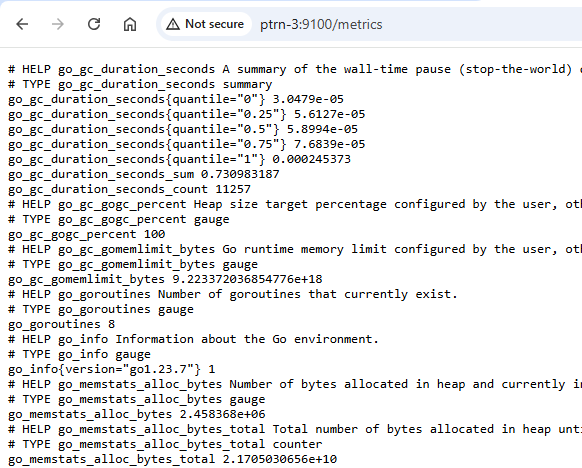
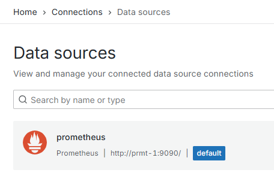
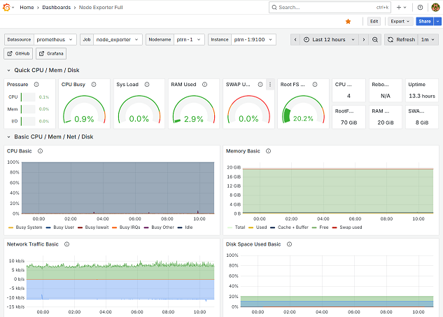
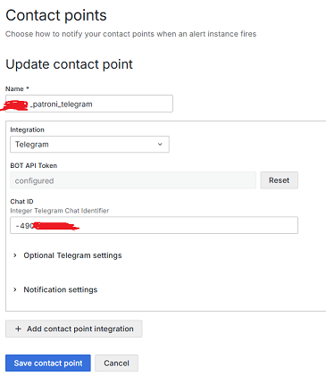
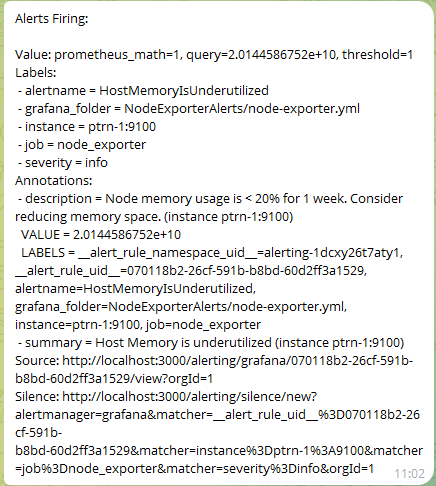

# Описание диплома

**Задача:** собрать отказоусточивый кластер Patroni, в котором:
* Все компоненты работают в отказоустойчивом режиме и нет единой точки отказа.
* Все комнонента добавлены в систему Observability и мониторятся.

Используемое ПО: 
* Ubuntu 24.04.3 LTS
* Prometheus 3.5.0
* Grafana 12.1.1
* Node Exporter 1.9.1

## Первичная подготовка

Устанавливаем ОС на 4 ВМ:
* Для кластера Patroni: ptrn-1, ptrn-2, ptrn-3
* Для системы Observability: prmt-1

Запускаем на каждой ВМ:

    sudo apt update && sudo apt upgrade -y && sudo apt reboot

Добавляем в /etc/hosts на всех машинах:

    192.168.2.105 ptrn-1
    192.168.2.91  ptrn-2
    192.168.2.98  ptrn-3
    192.168.2.99  prmt-1

## Установка Node Exporter

Выполняем на всех 4 нодах.

Команды скачивания бинарника и копирования его в /usr/local/bin:

    wget https://github.com/prometheus/node_exporter/releases/download/v1.9.1/node_exporter-1.9.1.linux-amd64.tar.gz
    tar -xvf node_exporter-1.9.1.linux-amd64.tar.gz
    mv node_exporter-1.9.1.linux-amd64/node_exporter /usr/local/bin/
    sudo chown node_exporter:node_exporter /usr/local/bin/node_exporter

Создаем systemd юнит:

    sudo tee /etc/systemd/system/node_exporter.service <<"EOF"
    [Unit]
    Description=Node Exporter

    [Service]
    User=node_exporter
    Group=node_exporter
    EnvironmentFile=-/etc/sysconfig/node_exporter
    ExecStart=/usr/local/bin/node_exporter $OPTIONS \
            --collector.systemd \
            --collector.processes

    [Install]
    WantedBy=multi-user.target
    EOF

Запускаем сервис и добавляем его в enabled:

    sudo systemctl daemon-reload && sudo systemctl start node_exporter && sudo systemctl status node_exporter && sudo systemctl enable node_exporter

Проверяем, что все 4 ВМ начинают отдавать метрики на порту 9100:

## Установка Prometheus и Grafana

Создаем на prmt-01 директории и меняем на них права:

    mkdir /opt/prometheus
    mkdir /opt/prometheus/rules
    mkdir /opt/prometheus_data
    mkdir /opt/grafana_data
    chown -R vasya:vasya /opt/prometheus
    chown -R vasya:vasya /opt/prometheus_data/
    chown -R vasya:vasya /opt/grafana_data/

Здесь vasya - пользователь, который был создан при установке Ubuntu и имеет id 1000:

    root@prmt-1:~# cat /etc/passwd | grep 1000
    vasya:x:1000:1000:vasya:/home/vasya:/bin/bash
    root@prmt-1:~# cat /etc/group | grep 1000
    vasya:x:1000:

Создаем файл **compose.yaml**:

    services:

    prometheus:
        image: prom/prometheus:v3.5.0
        container_name: prometheus
        user: "1000:1000"
        ports:
        - "9090:9090"
        volumes:
        - /opt/prometheus:/etc/prometheus
        - /opt/prometheus_data:/prometheus
        environment:
        - TZ=Europe/Moscow
        command:
        - '--config.file=/etc/prometheus/prometheus.yml'
        - '--storage.tsdb.path=/prometheus'
        networks:
        - monitoring_network
        restart: unless-stopped

    grafana:
        image: grafana/grafana:12.1.1
        container_name: grafana
        user: "1000:1000"
        ports:
        - "3000:3000"
        volumes:
        - /opt/grafana_data:/var/lib/grafana
        environment:
        - GF_SECURITY_ADMIN_USER=admin
        - GF_SECURITY_ADMIN_PASSWORD=admin123
        - GF_USERS_ALLOW_SIGN_UP=false
        - TZ=Europe/Moscow
        networks:
        - monitoring_network
        restart: unless-stopped

    networks:
    monitoring_network:

Проверяем, что контейнеры запустились:

    root@prmt-1:~# docker ps
    CONTAINER ID   IMAGE                    COMMAND                  CREATED         STATUS         PORTS                                         NAMES
    5116461baacc   grafana/grafana:12.1.1   "/run.sh"                7 seconds ago   Up 7 seconds   0.0.0.0:3000->3000/tcp, [::]:3000->3000/tcp   grafana
    4c2be41e9fdf   prom/prometheus:v3.5.0   "/bin/prometheus --c…"   12 hours ago    Up 11 hours    0.0.0.0:9090->9090/tcp, [::]:9090->9090/tcp   prometheus

## Настройка Prometheus

Копируем файл node-exporter.yml в директорию /opt/prometheus/rules и добавляем его в prometheus.yml. Добавляем эндпойнты в scrape_config:

    root@prmt-1:~# cat /opt/prometheus/prometheus.yml
    global:
    scrape_interval: 15s

    rule_files:
    - "rules/node-exporter.yml"

    scrape_configs:
    - job_name: 'prometheus'
        static_configs:
        - targets: ['localhost:9090']

    - job_name: 'node_exporter'
        static_configs:
        - targets: ['ptrn-1:9100', 'ptrn-2:9100', 'ptrn-3:9100', 'prmt-1:9100']

Проверяем что Prometheus работает на порту 9090 и успешно скрэйпит эндпойнты:

## Настройка Grafana

Добавляем в качестве Data Source наш сервер Prometheus:

Импортируем дашборд Node Exporter и проверяем, что данные собираются:

## Настройка алертов Grafana в Telegram

Создаем в Графане Contact Point с заданным ChatID и токеном:

Проверяем, что алерты приходят:

## Установка и настройка кластера ETCD

-

