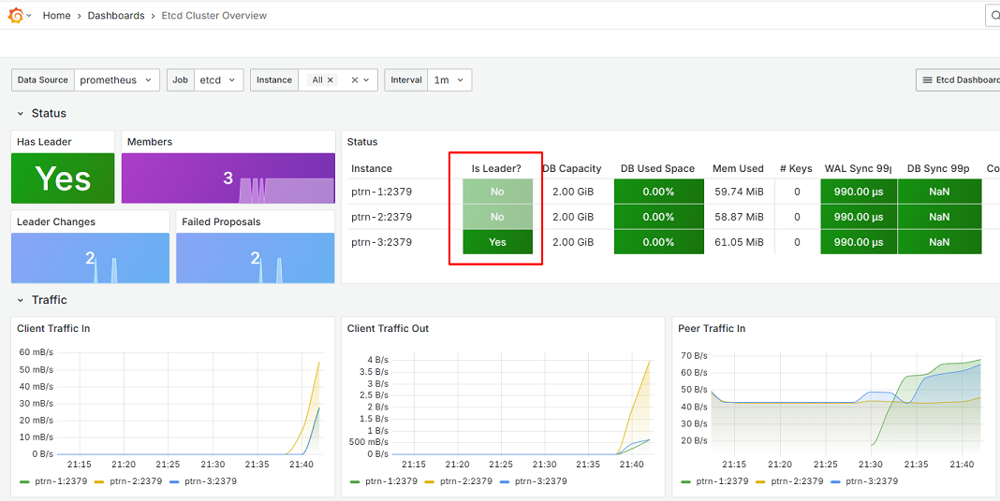
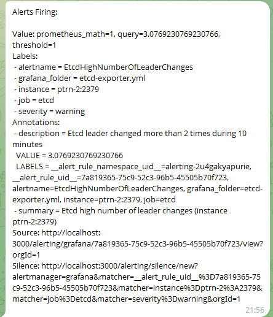
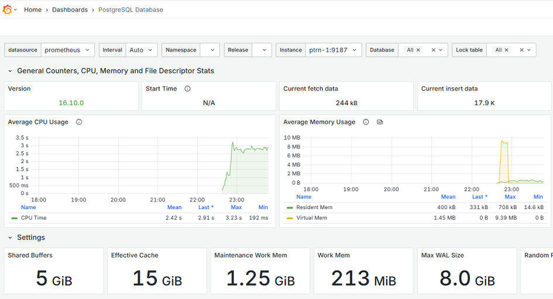
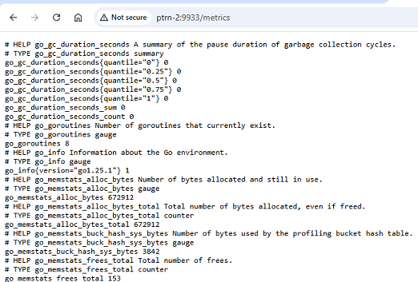

# Описание диплома

**Задача:** собрать отказоусточивый кластер Patroni, в котором:
* Все компоненты работают в отказоустойчивом режиме и нет единой точки отказа.
* Все комнонента добавлены в систему Observability и мониторятся.

Используемое ПО: 
* Ubuntu 24.04.3 LTS
* Prometheus 3.5.0
* Grafana 12.1.1
* Node Exporter 1.9.1
* ETCD 3.6.4
* PostgreSQL 16
* Postgres Exporter: https://github.com/prometheus-community/postgres_exporter
* Patroni 4.0.6

## Первичная подготовка

Устанавливаем ОС на 4 ВМ:
* Для кластера Patroni: ptrn-1, ptrn-2, ptrn-3
* Для системы Observability: prmt-1

Запускаем на каждой ВМ:

    sudo apt update && sudo apt upgrade -y && sudo apt reboot

Добавляем в /etc/hosts на всех машинах:

    192.168.2.96  ptrn-1
    192.168.2.91  ptrn-2
    192.168.2.98  ptrn-3
    192.168.2.99  prmt-1

## Установка Node Exporter

Выполняем на всех 4 нодах.

Команды скачивания бинарника и копирования его в /usr/local/bin:

    wget https://github.com/prometheus/node_exporter/releases/download/v1.9.1/node_exporter-1.9.1.linux-amd64.tar.gz
    tar -xvf node_exporter-1.9.1.linux-amd64.tar.gz
    mv node_exporter-1.9.1.linux-amd64/node_exporter /usr/local/bin/
    sudo chown node_exporter:node_exporter /usr/local/bin/node_exporter

Создаем systemd юнит:

    sudo tee /etc/systemd/system/node_exporter.service <<"EOF"
    [Unit]
    Description=Node Exporter

    [Service]
    User=node_exporter
    Group=node_exporter
    EnvironmentFile=-/etc/sysconfig/node_exporter
    ExecStart=/usr/local/bin/node_exporter $OPTIONS \
            --collector.systemd \
            --collector.processes

    [Install]
    WantedBy=multi-user.target
    EOF

Запускаем сервис и добавляем его в enabled:

    sudo systemctl daemon-reload && sudo systemctl start node_exporter && sudo systemctl status node_exporter && sudo systemctl enable node_exporter

Проверяем, что все 4 ВМ начинают отдавать метрики на порту 9100:

## Установка Prometheus и Grafana

Создаем на prmt-01 директории и меняем на них права:

    mkdir /opt/prometheus
    mkdir /opt/prometheus/rules
    mkdir /opt/prometheus_data
    mkdir /opt/grafana_data
    chown -R vasya:vasya /opt/prometheus
    chown -R vasya:vasya /opt/prometheus_data/
    chown -R vasya:vasya /opt/grafana_data/

Здесь vasya - пользователь, который был создан при установке Ubuntu и имеет id 1000:

    root@prmt-1:~# cat /etc/passwd | grep 1000
    vasya:x:1000:1000:vasya:/home/vasya:/bin/bash
    root@prmt-1:~# cat /etc/group | grep 1000
    vasya:x:1000:

Создаем файл **compose.yaml**:

    services:

    prometheus:
        image: prom/prometheus:v3.5.0
        container_name: prometheus
        user: "1000:1000"
        ports:
        - "9090:9090"
        volumes:
        - /opt/prometheus:/etc/prometheus
        - /opt/prometheus_data:/prometheus
        environment:
        - TZ=Europe/Moscow
        command:
        - '--config.file=/etc/prometheus/prometheus.yml'
        - '--storage.tsdb.path=/prometheus'
        networks:
        - monitoring_network
        restart: unless-stopped

    grafana:
        image: grafana/grafana:12.1.1
        container_name: grafana
        user: "1000:1000"
        ports:
        - "3000:3000"
        volumes:
        - /opt/grafana_data:/var/lib/grafana
        environment:
        - GF_SECURITY_ADMIN_USER=admin
        - GF_SECURITY_ADMIN_PASSWORD=admin123
        - GF_USERS_ALLOW_SIGN_UP=false
        - TZ=Europe/Moscow
        networks:
        - monitoring_network
        restart: unless-stopped

    networks:
    monitoring_network:

Проверяем, что контейнеры запустились:

    root@prmt-1:~# docker ps
    CONTAINER ID   IMAGE                    COMMAND                  CREATED         STATUS         PORTS                                         NAMES
    5116461baacc   grafana/grafana:12.1.1   "/run.sh"                7 seconds ago   Up 7 seconds   0.0.0.0:3000->3000/tcp, [::]:3000->3000/tcp   grafana
    4c2be41e9fdf   prom/prometheus:v3.5.0   "/bin/prometheus --c…"   12 hours ago    Up 11 hours    0.0.0.0:9090->9090/tcp, [::]:9090->9090/tcp   prometheus

## Настройка Prometheus

Копируем файл node-exporter.yml в директорию /opt/prometheus/rules и добавляем его в prometheus.yml. Добавляем эндпойнты в scrape_config:

    root@prmt-1:~# cat /opt/prometheus/prometheus.yml
    global:
    scrape_interval: 15s

    rule_files:
    - "rules/node-exporter.yml"

    scrape_configs:
    - job_name: 'prometheus'
        static_configs:
        - targets: ['localhost:9090']

    - job_name: 'node_exporter'
        static_configs:
        - targets: ['ptrn-1:9100', 'ptrn-2:9100', 'ptrn-3:9100', 'prmt-1:9100']

Проверяем что Prometheus работает на порту 9090 и успешно скрэйпит эндпойнты:

## Настройка Grafana

Добавляем в качестве Data Source наш сервер Prometheus:

Импортируем дашборд Node Exporter и проверяем, что данные собираются:

## Настройка алертов Grafana в Telegram

Создаем в Графане Contact Point с заданным ChatID и токеном:

Проверяем, что алерты приходят:

> NOTE: рендеринг красивых Go-шаблонов для алертов в Телеге останется за пределами данного дипломного проекта!

## Установка и настройка кластера ETCD

Выполняем на нодах ptrn-1, ptrn-2, ptrn-3:

    wget https://github.com/etcd-io/etcd/releases/download/v3.6.4/etcd-v3.6.4-linux-amd64.tar.gz
    tar xzvf etcd-v3.6.4-linux-amd64.tar.gz
    mv /tmp/etcd-v3.6.4-linux-amd64/etcd* /usr/local/bin/
    groupadd --system etcd
    useradd -s /sbin/nologin --system -g etcd etcd
    mkdir /opt/etcd
    mkdir /etc/etcd
    chown -R etcd:etcd /opt/etcd
    chmod -R 700 /opt/etcd/

Создаем конфигурационный файл /etc/etcd/etcd.conf.

ptrn-1:

    ETCD_NAME="ptrn-1"
    ETCD_LISTEN_CLIENT_URLS="http://192.168.2.96:2379,http://127.0.0.1:2379"
    ETCD_ADVERTISE_CLIENT_URLS="http://192.168.2.96:2379"
    ETCD_LISTEN_PEER_URLS="http://192.168.2.96:2380"
    ETCD_INITIAL_ADVERTISE_PEER_URLS="http://192.168.2.96:2380"
    ETCD_INITIAL_CLUSTER_TOKEN="etcd-postgres-cluster"
    ETCD_INITIAL_CLUSTER="ptrn-1=http://192.168.2.96:2380,ptrn-2=http://192.168.2.91:2380,ptrn-3=http://192.168.2.98:2380"
    ETCD_INITIAL_CLUSTER_STATE="new"
    ETCD_DATA_DIR="/opt/etcd"
    ETCD_ELECTION_TIMEOUT="10000"
    ETCD_HEARTBEAT_INTERVAL="2000"
    ETCD_INITIAL_ELECTION_TICK_ADVANCE="false"
    ETCD_ENABLE_V2="true"

ptrn-2:

    ETCD_NAME="ptrn-2"
    ETCD_LISTEN_CLIENT_URLS="http://192.168.2.91:2379,http://127.0.0.1:2379"
    ETCD_ADVERTISE_CLIENT_URLS="http://192.168.2.91:2379"
    ETCD_LISTEN_PEER_URLS="http://192.168.2.91:2380"
    ETCD_INITIAL_ADVERTISE_PEER_URLS="http://192.168.2.91:2380"
    ETCD_INITIAL_CLUSTER_TOKEN="etcd-postgres-cluster"
    ETCD_INITIAL_CLUSTER="ptrn-1=http://192.168.2.96:2380,ptrn-2=http://192.168.2.91:2380,ptrn-3=http://192.168.2.98:2380"
    ETCD_INITIAL_CLUSTER_STATE="new"
    ETCD_DATA_DIR="/opt/etcd"
    ETCD_ELECTION_TIMEOUT="10000"
    ETCD_HEARTBEAT_INTERVAL="2000"
    ETCD_INITIAL_ELECTION_TICK_ADVANCE="false"
    ETCD_ENABLE_V2="true"

ptrn-3:

    ETCD_NAME="ptrn-3"
    ETCD_LISTEN_CLIENT_URLS="http://192.168.2.98:2379,http://127.0.0.1:2379"
    ETCD_ADVERTISE_CLIENT_URLS="http://192.168.2.98:2379"
    ETCD_LISTEN_PEER_URLS="http://192.168.2.98:2380"
    ETCD_INITIAL_ADVERTISE_PEER_URLS="http://192.168.2.98:2380"
    ETCD_INITIAL_CLUSTER_TOKEN="etcd-postgres-cluster"
    ETCD_INITIAL_CLUSTER="ptrn-1=http://192.168.2.96:2380,ptrn-2=http://192.168.2.91:2380,ptrn-3=http://192.168.2.98:2380"
    ETCD_INITIAL_CLUSTER_STATE="new"
    ETCD_DATA_DIR="/opt/etcd"
    ETCD_ELECTION_TIMEOUT="10000"
    ETCD_HEARTBEAT_INTERVAL="2000"
    ETCD_INITIAL_ELECTION_TICK_ADVANCE="false"
    ETCD_ENABLE_V2="true"

Создаем на всех трёх нодах файл systemd-юнита:

    cat /etc/systemd/system/etcd.service
    [Unit]
    Description=Etcd Server
    Documentation=https://github.com/etcd-io/etcd
    After=network.target
    After=network-online.target
    Wants=network-online.target

    [Service]
    User=etcd
    Type=notify
    WorkingDirectory=/opt/etcd/
    EnvironmentFile=-/etc/etcd/etcd.conf
    User=etcd
    # set GOMAXPROCS to number of processors
    ExecStart=/bin/bash -c "GOMAXPROCS=$(nproc) /usr/local/bin/etcd"
    Restart=on-failure
    LimitNOFILE=65536
    IOSchedulingClass=realtime
    IOSchedulingPriority=0
    Nice=-20

    [Install]
    WantedBy=multi-user.target

Запускаем службу на всех трех нодах:

    systemctl daemon-reload && systemctl enable etcd && systemctl start etcd

Видим, что кластер собрался и работает:

    root@ptrn-2:~# etcdctl member list
    513eb46eca501, started, ptrn-1, http://192.168.2.105:2380, http://192.168.2.96:2379, false
    455812df4c39a5e5, started, ptrn-3, http://192.168.2.98:2380, http://192.168.2.98:2379, false
    83b8164138628079, started, ptrn-2, http://192.168.2.91:2380, http://192.168.2.91:2379, false

    root@ptrn-2:~# etcdctl endpoint status --cluster
    http://192.168.2.96:2379, 513eb46eca501, 3.6.4, 3.6.0, 20 kB, 16 kB, 20%, 0 B, false, false, 7, 26, 26, , , false
    http://192.168.2.98:2379, 455812df4c39a5e5, 3.6.4, 3.6.0, 20 kB, 16 kB, 20%, 0 B, true, false, 7, 26, 26, , , false
    http://192.168.2.91:2379, 83b8164138628079, 3.6.4, 3.6.0, 20 kB, 16 kB, 20%, 0 B, false, false, 7, 26, 26, , , false

    root@ptrn-2:~# etcdctl endpoint health --cluster
    http://192.168.2.98:2379 is healthy: successfully committed proposal: took = 48.877664ms
    http://192.168.2.91:2379 is healthy: successfully committed proposal: took = 48.710623ms
    http://192.168.2.96:2379 is healthy: successfully committed proposal: took = 48.770278ms

На prmt-1 добавляем метрики etcd в prometheus.yml:

    root@prmt-1:~# cat /opt/prometheus/prometheus.yml
    global:
    scrape_interval: 15s

    rule_files:
    - "rules/node-exporter.yml"
    - "rules/etcd-exporter.yml"

    scrape_configs:
    - job_name: 'prometheus'
        static_configs:
        - targets: ['localhost:9090']

    - job_name: 'node_exporter'
        static_configs:
        - targets: ['ptrn-1:9100', 'ptrn-2:9100', 'ptrn-3:9100', 'prmt-1:9100']

    - job_name: "etcd"
        scrape_interval: 15s
        metrics_path: /metrics
        static_configs:
        - targets: ["ptrn-1:2379", "ptrn-2:2379", "ptrn-3:2379"]

Импортируем дашборд в Графану и в ней наблюдаем как при перезагрузке лидера кластера статус лидера переходит к другой ноде:

Установка и настройка кластера ETCD завершена.

Перезагружаем по очереди все ноды кластера и ловим алерт о том, что у нас слишком много смен лидера за последние 10 минут:

## Установка и настройка PostgreSQL 

Будем работать с PostgreSQL 16. Устанавливаем его на ptrn-1 и ptrn-2.
Для простоты будем работать с базой данных **postgres**:

    apt install -y postgresql-common
    /usr/share/postgresql-common/pgdg/apt.postgresql.org.sh
    apt update
    apt -y install postgresql-16

    root@ptrn-1:~# pg_lsclusters
    Ver Cluster Port Status Owner    Data directory              Log file
    16  main    5432 online postgres /var/lib/postgresql/16/main /var/log/postgresql/postgresql-16-main.log

Изменяем значения в postgresql.conf согласно best practices:

    # DB Version: 16
    # OS Type: linux
    # DB Type: oltp
    # Total Memory (RAM): 20 GB
    # CPUs num: 4
    # Connections num: 20
    # Data Storage: hdd

    max_connections = 20
    shared_buffers = 5GB
    effective_cache_size = 15GB
    maintenance_work_mem = 1280MB
    checkpoint_completion_target = 0.9
    wal_buffers = 16MB
    default_statistics_target = 100
    random_page_cost = 4
    effective_io_concurrency = 2
    work_mem = 218453kB
    huge_pages = off
    min_wal_size = 2GB
    max_wal_size = 8GB
    max_worker_processes = 4
    max_parallel_workers_per_gather = 2
    max_parallel_workers = 4
    max_parallel_maintenance_workers = 2
    shared_preload_libraries = 'pg_stat_statements'

Добавляем пользователя **replicator**:

    root@ptrn-1:~# sudo -u postgres psql
    psql (16.10 (Ubuntu 16.10-1.pgdg24.04+1))
    Type "help" for help.

    postgres=# create user replicator replication login encrypted password '123456';
    CREATE ROLE

Задаем пароль для пользователя **postgres**:

    postgres=# \password postgres;
    Enter new password for user "postgres": 123456
    Enter it again: 123456

Устанавливаем расширение **pg_stat_statements**:

    postgres=# CREATE EXTENSION pg_stat_statements;
    CREATE EXTENSION

Создаем пользователя **pgbouncer**:

    postgres=# create user pgbouncer password '123456';
    CREATE ROLE

Добавляем записи в **pg_hba.conf**. Для задач диплома обходимся выдачей "широкого" набора прав с точки зрения подсетей.

    # Database administrative login by Unix domain socket
    local   all             postgres                                peer

    # TYPE  DATABASE        USER            ADDRESS                 METHOD

    # "local" is for Unix domain socket connections only
    local   all             all                                     peer
    # IPv4 local connections:
    host    all             all             127.0.0.1/32            scram-sha-256
    host    all             all             192.168.0.0/16          md5
    # IPv6 local connections:
    host    all             all             ::1/128                 scram-sha-256
    # Allow replication connections from localhost, by a user with the
    # replication privilege.
    local   replication     all                                     peer
    host    replication     replicator      localhost               trust
    host    replication     all             127.0.0.1/32            scram-sha-256
    host    replication     all             ::1/128                 scram-sha-256
    host    replication     replicator      192.168.0.0/16          md5

Проверяем версию сервера:

    postgres=# SELECT version();
                                                                version
    -------------------------------------------------------------------------------------------------------------------------------------
    PostgreSQL 16.10 (Ubuntu 16.10-1.pgdg24.04+1) on x86_64-pc-linux-gnu, compiled by gcc (Ubuntu 13.3.0-6ubuntu2~24.04) 13.3.0, 64-bit
    (1 row)

На данный момент оставляем PostgreSQL работать на обоих серверах и переходим к настройке наблюдаемости.
Postgres Exporter устанавливается как Docker-контейнер.

Конфигурация:

    services:

    postgres-exporter:
        image: quay.io/prometheuscommunity/postgres-exporter
        container_name: postgres-exporter
        network_mode: "host"
        environment:
        - DATA_SOURCE_URI=localhost:5432/postgres?sslmode=disable
        - DATA_SOURCE_USER=postgres
        - DATA_SOURCE_PASS=123456
        restart: unless-stopped

Запуск:

    docker compose up -d

Добавляем эндпойнты в конфиг Prometheus:

    global:
    scrape_interval: 15s

    rule_files:
    - "rules/node-exporter.yml"
    - "rules/etcd-exporter.yml"
    - "rules/postgres-exporter.yml"

    scrape_configs:
    - job_name: 'prometheus'
        static_configs:
        - targets: ['localhost:9090']

    - job_name: 'node_exporter'
        static_configs:
        - targets: ['ptrn-1:9100', 'ptrn-2:9100', 'ptrn-3:9100', 'prmt-1:9100']

    - job_name: 'etcd'
        scrape_interval: 15s
        metrics_path: /metrics
        static_configs:
        - targets: ["ptrn-1:2379", "ptrn-2:2379", "ptrn-3:2379"]

    - job_name: 'postgres'
        static_configs:
        - targets: ["ptrn-1:9187", "ptrn-2:9187"]

Утаскиваем какой-нибудь дашборд с сайта Графаны:

И переходим к следующему этапу.

## Установка и настройка Patroni

Выполняем на ptrn-1 и ptrn-2.
Поскольку у нас уже добавлен репозиторий PGDG, то Patroni ставится одной простой командой:

    apt-get install patroni

После установки добавляем на хосты конфигурационный файл **/etc/patroni/patroni.yml**

ptrn-1:

    ---

    scope: postgres-cluster
    name: ptrn-1
    namespace: /service/

    restapi:
    listen: 192.168.2.96:8008
    connect_address: 192.168.2.96:8008
    authentication:
        username: patroni
        password: '123456'

    etcd3:
    hosts: 192.168.2.96:2379,192.168.2.91:2379,192.168.2.98:2379

    bootstrap:
    method: initdb
    dcs:
        ttl: 60
        loop_wait: 10
        retry_timeout: 27
        maximum_lag_on_failover: 2048576
        master_start_timeout: 300
        synchronous_mode: true
        synchronous_mode_strict: false
        synchronous_node_count: 1
        postgresql:
        use_pg_rewind: false
        use_slots: true
        parameters:
            max_connections: 800
            superuser_reserved_connections: 5
            max_locks_per_transaction: 64
            max_prepared_transactions: 0
            huge_pages: off
            shared_buffers: 5GB
            work_mem: 218453kB
            maintenance_work_mem: 1280MB
            effective_cache_size: 15GB
            checkpoint_timeout: 15min
            checkpoint_completion_target: 0.9
            min_wal_size: 2GB
            max_wal_size: 8GB
            wal_buffers: 16MB
            default_statistics_target: 100
            seq_page_cost: 1
            random_page_cost: 4
            effective_io_concurrency: 2
            synchronous_commit: on
            autovacuum: on
            autovacuum_max_workers: 5
            autovacuum_vacuum_scale_factor: 0.01
            autovacuum_analyze_scale_factor: 0.02
            autovacuum_vacuum_cost_limit: 200
            autovacuum_vacuum_cost_delay: 20
            autovacuum_naptime: 1s
            max_files_per_process: 4096
            archive_mode: on
            archive_timeout: 1800s
            archive_command: cd .
            wal_level: replica
            wal_keep_segments: 130
            max_wal_senders: 10
            max_replication_slots: 10
            hot_standby: on
            hot_standby_feedback: True
            wal_log_hints: on
            shared_preload_libraries: pg_stat_statements,auto_explain
            pg_stat_statements.max: 10000
            pg_stat_statements.track: all
            pg_stat_statements.save: off
            auto_explain.log_min_duration: 10s
            auto_explain.log_analyze: true
            auto_explain.log_buffers: true
            auto_explain.log_timing: false
            auto_explain.log_triggers: true
            auto_explain.log_verbose: true
            auto_explain.log_nested_statements: true
            track_io_timing: on
            log_lock_waits: on
            log_temp_files: 0
            track_activities: on
            track_counts: on
            track_functions: all
            log_checkpoints: on
            logging_collector: on
            log_statement: mod
            log_truncate_on_rotation: on
            log_rotation_age: 1d
            log_rotation_size: 0
            log_line_prefix: '%m [%p] %q%u@%d '
            log_filename: 'postgresql-%a.log'
            log_directory: /var/log/postgresql

    initdb:
        - encoding: UTF8
        - locale: en_US.UTF-8
        - data-checksums

    pg_hba:  # должен содержать адреса ВСЕХ машин, используемых в кластере
        - host all all 192.168.0.0/16 md5
        - host replication replicator 127.0.0.1/32 md5
        - host replication replicator 192.168.0.0/16 md5

    postgresql:
    listen: 192.168.2.96,127.0.0.1:5432
    connect_address: 192.168.2.96:5432
    use_unix_socket: true
    data_dir: /var/lib/postgresql/16/main
    bin_dir: /usr/lib/postgresql/16/bin
    config_dir: /etc/postgresql/16/main
    pgpass: /var/lib/postgresql/.pgpass_patroni
    authentication:
        replication:
        username: replicator
        password: 123456
        superuser:
        username: postgres
        password: 123456
    parameters:
        unix_socket_directories: /var/run/postgresql

    remove_data_directory_on_rewind_failure: false
    remove_data_directory_on_diverged_timelines: false

    create_replica_methods:
        - basebackup
    basebackup:
        max-rate: '100M'
        checkpoint: 'fast'

    watchdog:
    mode: off  # Allowed values: off, automatic, required
    device: /dev/watchdog
    safety_margin: 5

    tags:
    nofailover: false
    noloadbalance: false
    clonefrom: false
    nosync: false

ptrn-2:

    ---

    scope: postgres-cluster
    name: ptrn-2
    namespace: /service/

    restapi:
    listen: 192.168.2.91:8008
    connect_address: 192.168.2.91:8008
    authentication:
        username: patroni
        password: '123456'

    etcd3:
    hosts: 192.168.2.96:2379,192.168.2.91:2379,192.168.2.98:2379

    bootstrap:
    method: initdb
    dcs:
        ttl: 60
        loop_wait: 10
        retry_timeout: 27
        maximum_lag_on_failover: 2048576
        master_start_timeout: 300
        synchronous_mode: true
        synchronous_mode_strict: false
        synchronous_node_count: 1
        postgresql:
        use_pg_rewind: false
        use_slots: true
        parameters:
            max_connections: 800
            superuser_reserved_connections: 5
            max_locks_per_transaction: 64
            max_prepared_transactions: 0
            huge_pages: off
            shared_buffers: 5GB
            work_mem: 218453kB
            maintenance_work_mem: 1280MB
            effective_cache_size: 15GB
            checkpoint_timeout: 15min
            checkpoint_completion_target: 0.9
            min_wal_size: 2GB
            max_wal_size: 8GB
            wal_buffers: 16MB
            default_statistics_target: 100
            seq_page_cost: 1
            random_page_cost: 4
            effective_io_concurrency: 2
            synchronous_commit: on
            autovacuum: on
            autovacuum_max_workers: 5
            autovacuum_vacuum_scale_factor: 0.01
            autovacuum_analyze_scale_factor: 0.02
            autovacuum_vacuum_cost_limit: 200
            autovacuum_vacuum_cost_delay: 20
            autovacuum_naptime: 1s
            max_files_per_process: 4096
            archive_mode: on
            archive_timeout: 1800s
            archive_command: cd .
            wal_level: replica
            wal_keep_segments: 130
            max_wal_senders: 10
            max_replication_slots: 10
            hot_standby: on
            hot_standby_feedback: True
            wal_log_hints: on
            shared_preload_libraries: pg_stat_statements,auto_explain
            pg_stat_statements.max: 10000
            pg_stat_statements.track: all
            pg_stat_statements.save: off
            auto_explain.log_min_duration: 10s
            auto_explain.log_analyze: true
            auto_explain.log_buffers: true
            auto_explain.log_timing: false
            auto_explain.log_triggers: true
            auto_explain.log_verbose: true
            auto_explain.log_nested_statements: true
            track_io_timing: on
            log_lock_waits: on
            log_temp_files: 0
            track_activities: on
            track_counts: on
            track_functions: all
            log_checkpoints: on
            logging_collector: on
            log_statement: mod
            log_truncate_on_rotation: on
            log_rotation_age: 1d
            log_rotation_size: 0
            log_line_prefix: '%m [%p] %q%u@%d '
            log_filename: 'postgresql-%a.log'
            log_directory: /var/log/postgresql

    initdb:
        - encoding: UTF8
        - locale: en_US.UTF-8
        - data-checksums

    pg_hba:  # должен содержать адреса ВСЕХ машин, используемых в кластере
        - host all all 0.0.0.0/0 md5
        - host replication replicator 127.0.0.1/32 md5
        - host replication replicator 10.0.2.0/24 md5

    postgresql:
    listen: 192.168.2.91,127.0.0.1:5432
    connect_address: 192.168.2.91:5432
    use_unix_socket: true
    data_dir: /var/lib/postgresql/16/main
    bin_dir: /usr/lib/postgresql/16/bin
    config_dir: /etc/postgresql/16/main
    pgpass: /var/lib/postgresql/.pgpass_patroni
    authentication:
        replication:
        username: replicator
        password: 123456
        superuser:
        username: postgres
        password: 123456
    parameters:
        unix_socket_directories: /var/run/postgresql

    remove_data_directory_on_rewind_failure: false
    remove_data_directory_on_diverged_timelines: false

    create_replica_methods:
        - basebackup
    basebackup:
        max-rate: '100M'
        checkpoint: 'fast'

    watchdog:
    mode: off  # Allowed values: off, automatic, required
    device: /dev/watchdog
    safety_margin: 5

    tags:
    nofailover: false
    noloadbalance: false
    clonefrom: false
    nosync: false

Назначаем права:

    chown postgres:postgres -R /etc/patroni
    chmod 700 /etc/patroni

Тестируем запуск Patroni на обеих нодах.
Перед стартом удаляем папку **/var/lib/postgresql/16** на ptrn-2 - если этого не сделать, то Patroni будет считать, что это отделный кластер:

    sudo -u postgres patroni /etc/patroni/patroni.yml

В результате на ptrn-2 создается файл .pgpass_patroni, на который надо добавить права:

    chown postgres:postgres /var/lib/postgresql/.pgpass_patroni
    chmod 0600 /var/lib/postgresql/.pgpass_patroni
    cat /var/lib/postgresql/.pgpass_patroni
    192.168.2.96:5432:*:replicator:123456

На ptrn-1 такой файл не создается, так как предполагается односторонняя репликация.
Но на всякий случай на будущее создадим его руками:

    cat /var/lib/postgresql/.pgpass_patroni
    192.168.2.91:5432:*:replicator:123456

Создаем на каждой ноде systemd-юнит:

    root@ptrn-1:~# cat /etc/systemd/system/patroni.service
    [Unit]
    Description=High availability PostgreSQL Cluster
    After=syslog.target network.target

    [Service]
    Type=simple
    User=postgres
    Group=postgres

    # Read in configuration file if it exists, otherwise proceed
    EnvironmentFile=-/etc/patroni_env.conf

    # Start the patroni process
    ExecStart=/usr/bin/patroni /etc/patroni/patroni.yml

    # Send HUP to reload from patroni.yml
    ExecReload=/bin/kill -s HUP $MAINPID

    # only kill the patroni process, not it's children, so it will gracefully stop postgres
    KillMode=process

    # Give a reasonable amount of time for the server to start up/shut down
    TimeoutSec=60

    # Do not restart the service if it crashes, we want to manually inspect database on failure
    Restart=no

    [Install]
    WantedBy=multi-user.target

Стартуем юнит, добавляем в enabled:

    systemctl daemon-reload
    systemctl start patroni
    systemctl status patroni
    systemctl enable patroni

Проверяем статус служб:

ptrn-1:

    Sep 13 20:15:40 ptrn-1 patroni[26747]: 2025-09-13 20:15:40,885 INFO: no action. I am (ptrn-1), the leader with the lock
    Sep 13 20:15:46 ptrn-1 patroni[26747]: 2025-09-13 20:15:46,885 INFO: no action. I am (ptrn-1), the leader with the lock
    Sep 13 20:15:52 ptrn-1 patroni[26747]: 2025-09-13 20:15:52,886 INFO: no action. I am (ptrn-1), the leader with the lock
    Sep 13 20:15:58 ptrn-1 patroni[26747]: 2025-09-13 20:15:58,886 INFO: no action. I am (ptrn-1), the leader with the lock
    Sep 13 20:16:04 ptrn-1 patroni[26747]: 2025-09-13 20:16:04,886 INFO: no action. I am (ptrn-1), the leader with the lock

ptrn-2:

    Sep 13 20:16:05 ptrn-2 patroni[25766]: 2025-09-13 20:16:05,478 INFO: no action. I am (ptrn-2), a secondary, and following a leader (ptrn-1)
    Sep 13 20:16:11 ptrn-2 patroni[25766]: 2025-09-13 20:16:11,477 INFO: no action. I am (ptrn-2), a secondary, and following a leader (ptrn-1)
    Sep 13 20:16:17 ptrn-2 patroni[25766]: 2025-09-13 20:16:17,477 INFO: no action. I am (ptrn-2), a secondary, and following a leader (ptrn-1)
    Sep 13 20:16:23 ptrn-2 patroni[25766]: 2025-09-13 20:16:23,478 INFO: no action. I am (ptrn-2), a secondary, and following a leader (ptrn-1)
    Sep 13 20:16:29 ptrn-2 patroni[25766]: 2025-09-13 20:16:29,477 INFO: no action. I am (ptrn-2), a secondary, and following a leader (ptrn-1)

Выглядит так, как будто всё хорошо. Проверяем статус с помощью **patronictl**:

ptrn-1:

    root@ptrn-1:~# patronictl -c /etc/patroni/patroni.yml list
    + Cluster: postgres-cluster (7549272789437793390) -+----+-----------+
    | Member | Host         | Role         | State     | TL | Lag in MB |
    +--------+--------------+--------------+-----------+----+-----------+
    | ptrn-1 | 192.168.2.96 | Leader       | running   |  3 |           |
    | ptrn-2 | 192.168.2.91 | Sync Standby | streaming |  3 |         0 |
    +--------+--------------+--------------+-----------+----+-----------+

ptrn-2:

    root@ptrn-2:~# patronictl -c /etc/patroni/patroni.yml list
    + Cluster: postgres-cluster (7549272789437793390) -+----+-----------+
    | Member | Host         | Role         | State     | TL | Lag in MB |
    +--------+--------------+--------------+-----------+----+-----------+
    | ptrn-1 | 192.168.2.96 | Leader       | running   |  3 |           |
    | ptrn-2 | 192.168.2.91 | Sync Standby | streaming |  3 |         0 |
    +--------+--------------+--------------+-----------+----+-----------+

На этом пока с Patroni всё. Тестировать failover, switchover и прочие режимы работы будем позже.
Сейчас надо настроить observability.

Выбираем вот этот exporter, представляющий собой бинарь на Go: https://github.com/gopaytech/patroni_exporter

Устанавливаем утилиту make и среду Go:

    apt install make
    add-apt-repository ppa:longsleep/golang-backports
    apt update
    apt install golang-go

Собираем приложение:

    make build

И получаем бинарь, отдающий на порту 9933 метрики Patroni:

    root@ptrn-2:~# cd patroni_exporter-main/.build/linux-amd64/
    root@ptrn-2:~/patroni_exporter-main/.build/linux-amd64# ./patroni_exporter --patroni.host="http://ptrn-2" --patroni.port=8008
    level=info ts=2025-09-13T20:22:49.354Z caller=main.go:37 msg="Starting patroni_exporter" version="(version=, branch=, revision=)"
    level=info ts=2025-09-13T20:22:49.355Z caller=main.go:38 msg="Build context" context="(go=go1.25.1, user=, date=)"
    level=info ts=2025-09-13T20:22:49.355Z caller=main.go:47 msg="Listening on address" address=:9933

Видим, что метрики отдаются: 

Собираем и этот экспортёр в systemd-юнит:

    root@ptrn-2:~# vim /etc/systemd/system/patroni-exporter.service
    [Unit]
    Description=Patroni Exporter service
    After=syslog.target network.target

    [Service]
    Type=simple
    User=postgres
    Group=postgres

    # Start the patroni process
    ExecStart=/usr/local/bin/patroni_exporter --patroni.host="http://ptrn-2" --patroni.port=8008

    # Send HUP to reload from patroni.yml
    ExecReload=/bin/kill -s HUP $MAINPID

    # only kill the patroni process, not it's children, so it will gracefully stop postgres
    KillMode=process

    # Give a reasonable amount of time for the server to start up/shut down
    TimeoutSec=60

    # Do not restart the service if it crashes, we want to manually inspect database on failure
    Restart=on-failure

    [Install]
    WantedBy=multi-user.target

Стартуем и енаблим:

    systemctl daemon-reload
    systemctl start patroni-exporter.service
    systemctl status patroni-exporter.service
    systemctl enable patroni-exporter.service

И добавляем в конфиг Prometheus:

    global:
    scrape_interval: 15s

    rule_files:
    - "rules/node-exporter.yml"
    - "rules/etcd-exporter.yml"
    - "rules/postgres-exporter.yml"

    scrape_configs:
    - job_name: 'prometheus'
        static_configs:
        - targets: ['localhost:9090']

    - job_name: 'node_exporter'
        static_configs:
        - targets: ['ptrn-1:9100', 'ptrn-2:9100', 'ptrn-3:9100', 'prmt-1:9100']

    - job_name: 'etcd'
        scrape_interval: 15s
        metrics_path: /metrics
        static_configs:
        - targets: ["ptrn-1:2379", "ptrn-2:2379", "ptrn-3:2379"]

    - job_name: 'postgres'
        static_configs:
        - targets: ["ptrn-1:9187", "ptrn-2:9187"]

    - job_name: 'patroni'
        static_configs:
        - targets: ["ptrn-1:9933", "ptrn-2:9933"]

Так как готовых наборов алертов и дашбордов для Графаны для этого экспортёра нет - сосредоточимся на следующих шагах!

## Установка и настройка keepalived